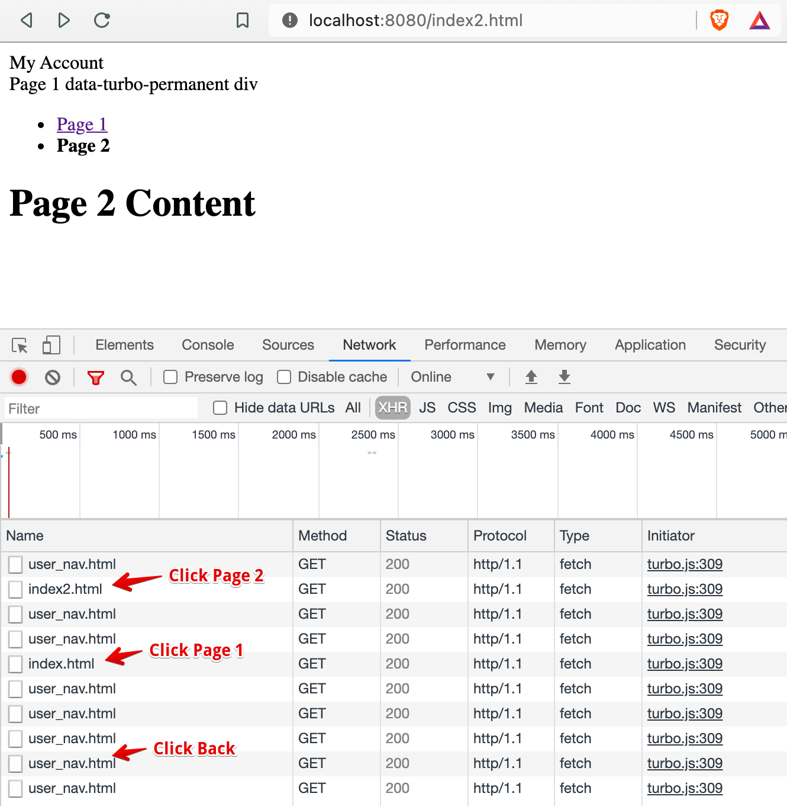

# turbo-frame with data-turbo-permanent

A wrapping `div[data-turbo-permanent]` element is used to try to make the turbo-frame element load only once on first
page load.

When clicking Page 2 (after the first page load), there are 2 extra requests to user_nav.html. After clicking Back
there's an additional request to user_nav.html.

